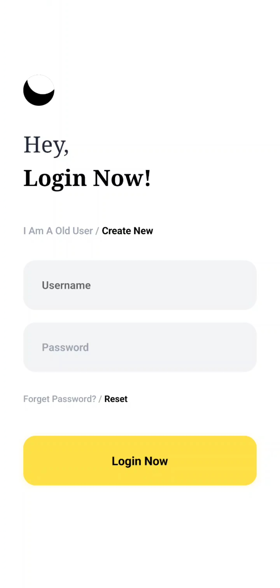
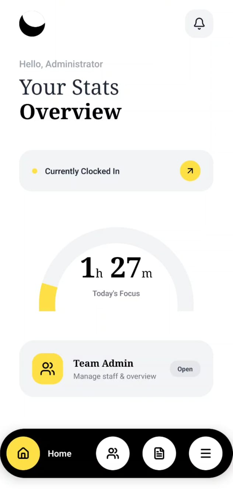
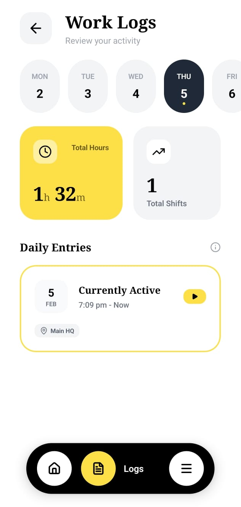
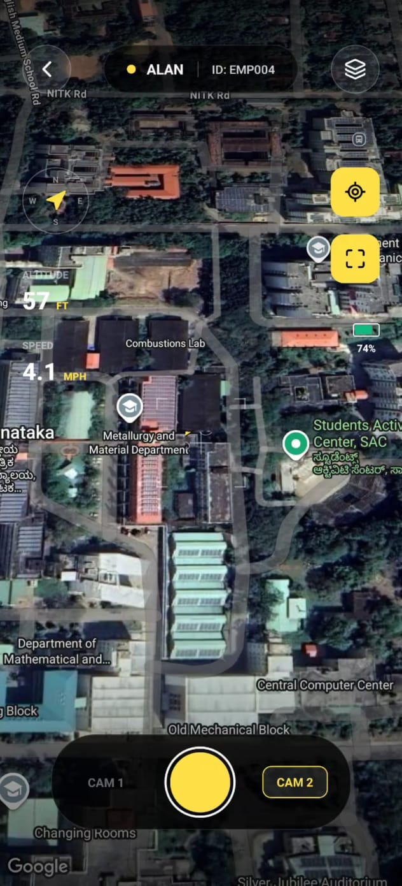
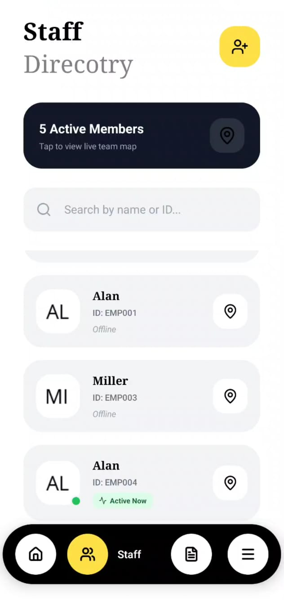

# GPS Attendance Tracker

A cross-platform mobile app (Android & iOS) that automatically clocks employees in and out using GPS geofencing — no manual punch-in required.

Built with **React Native + Expo**.

---

## Screenshots

<table>
  <tr>
    <td align="center"><b>Login</b></td>
    <td align="center"><b>Dashboard</b></td>
    <td align="center"><b>Work Logs</b></td>
    <td align="center"><b>Live Tracking</b></td>
    <td align="center"><b>Staff Directory</b></td>
  </tr>
  <tr>
    <td></td>
    <td></td>
    <td></td>
    <td></td>
    <td></td>
  </tr>
</table>

---

## Features

- **Automatic Geofencing** — GPS detects office entry/exit and clocks in/out automatically
- **Background Location Tracking** — Works even when the app is closed, via `expo-task-manager`
- **Anti-Fraud Protection** — Rejects mocked GPS, filters low-accuracy signals, ignores brief false-positive exits (<5 min)
- **Live Map View** — Google Maps with animated geofence circle showing the office zone
- **Today's Focus Gauge** — Visual arc showing hours worked vs. 8-hour target
- **Work Logs** — Full attendance history with daily calendar, total hours, and shift count
- **Admin Panel** — Staff directory, live team map, employee status tracking
- **Push Notifications** — Instant alerts on clock-in and clock-out
- **Offline-First** — Sessions stored locally; designed for backend sync

---

## Tech Stack

| Layer | Technology |
|---|---|
| Framework | React Native 0.81 + Expo SDK 54 |
| Navigation | Expo Router (file-based) |
| Maps | react-native-maps (Google Maps) |
| Location | expo-location + expo-task-manager |
| Animations | react-native-reanimated |
| Storage | AsyncStorage + Firebase |
| State | React Context API |
| Language | TypeScript |

---

## Getting Started

1. Install dependencies

   ```bash
   npm install
   ```

2. Start the app

   ```bash
   npx expo start
   ```

Run on Android emulator, iOS simulator, or scan the QR code with Expo Go.

---

## Backend Integration

The app is designed to sync with a Django REST Framework backend. See [BACKEND_INTEGRATION.md](BACKEND_INTEGRATION.md) for API endpoint definitions, payload structure, and a sample DRF serializer.
